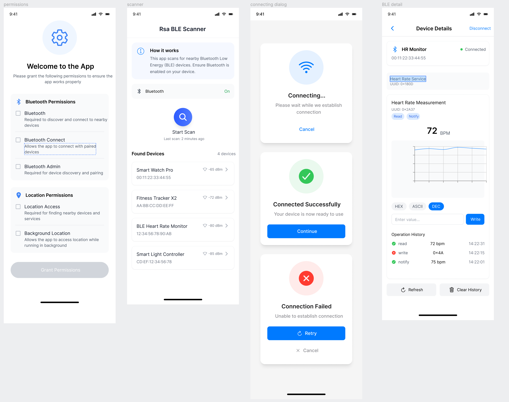

# RSA Evaluation Task

A modern Android application built with Jetpack Compose for evaluating RSA company interview task.

## ScreenShots

designed in https://motiff.com by mneckoee

## Project Overview

This Android application is built using modern Android development tools and practices, featuring a clean code approach with the following key components:

- **UI**: Built with Jetpack Compose
- **Architecture**: Multi-module clean code
- **Dependency Injection**: Hilt
- **Build System**: Gradle with Kotlin DSL

## Project Structure

The project is organized into multiple modules:
- `app`: Main application module
- `core`: Core functionality and shared components
- `feature`: Feature-specific implementations

## Technical Stack

- **Minimum SDK**: 24
- **Target SDK**: 35
- **Language**: Kotlin
- **UI Framework**: Jetpack Compose
- **Build System**: Gradle with Kotlin DSL
- **Dependency Management**: Version catalogs (libs.versions.toml)

## Key Features

- Modern UI built with Jetpack Compose
- Clean code implementation
- Modular project structure
- Release signing configuration

## Building the Project

### Prerequisites
- Android Studio Arctic Fox or newer
- JDK 11 or higher
- Android SDK with minimum API 24

### Build Steps
1. Clone the repository
2. Open the project in Android Studio
3. Sync project with Gradle files
4. Run the application on an emulator or physical device

## Development Setup

The project uses Gradle with Kotlin DSL for build configuration. Key build features include:
- Compose UI enabled
- Proguard optimization for release builds
- Debug and release signing configurations

## Contact

For any inquiries, please contact mneckoee@gmail.com
